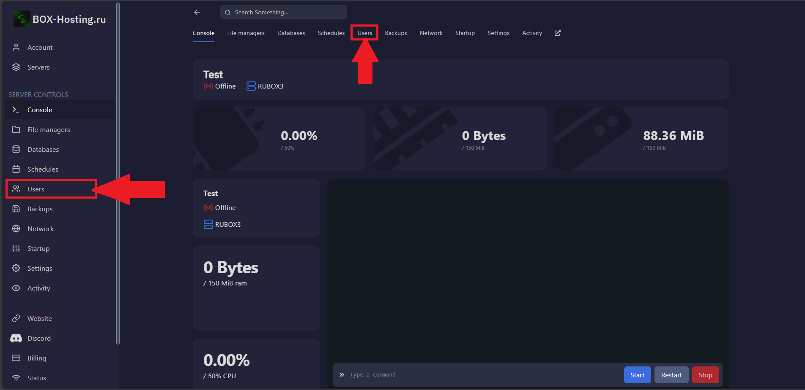
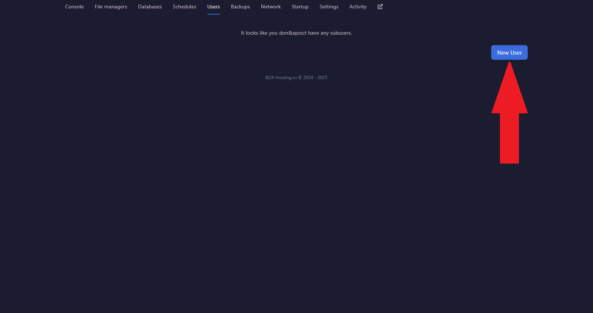
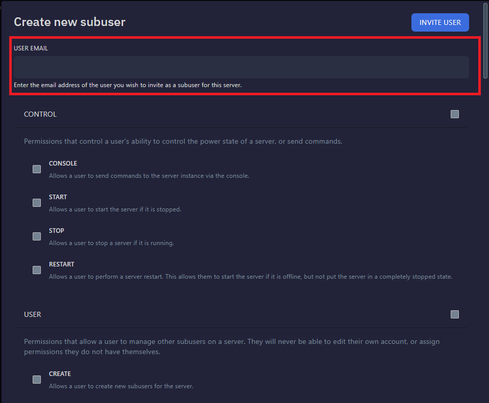
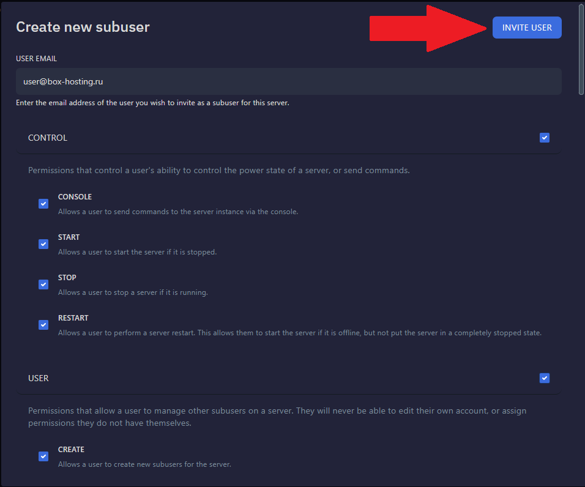

# 👨‍🦰 Как выдать доступ пользователю?

###Войдите в [панель управления](https://panel.box-hosting.ru)
 1. Нажмите на Ваш сервер
 2. Нажмите на вкладку Users
 
 
 
 3. Нажмите на New User
 
 
 
 4. Введите почту (пример: user@box-hosting.ru)
 
 
 
 5. Выберите нужные права, если хотите дать все права то выберайте всё
 6. Нажмите на INVITE USER
 
  
  
🎉 Готово! Вы добавили доступ к серверу.

:::warning
Доступ к серверу будет выдан только в [панель управления](https://panel.box-hosting.ru)
:::