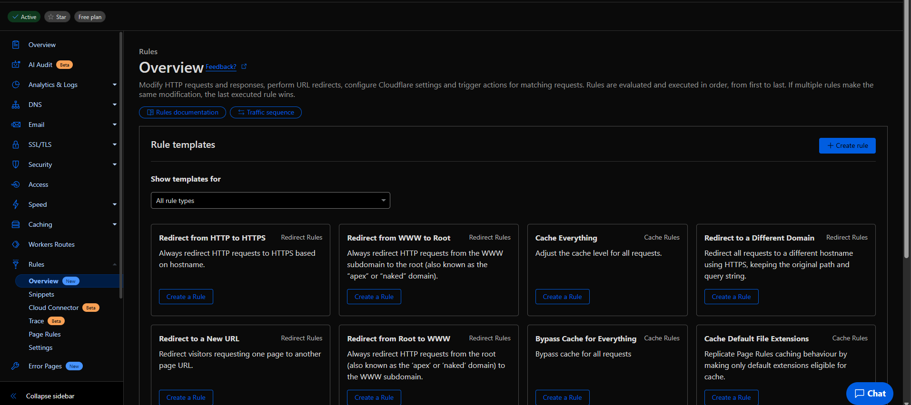
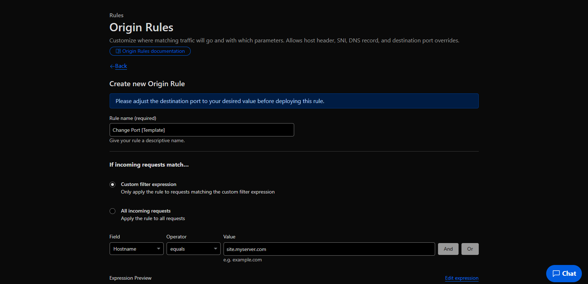
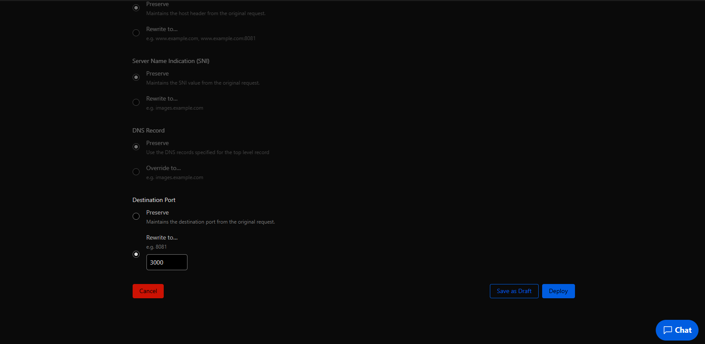

# 🌍 Подключение домена к вебсерверу
### Подключение домена к вебсерверу (сайт)

Чтобы подключить домен к вебсерверу, необходимо:

1. Привяжите домен в CloudFlare, для этого:
* Перейдите на [https://dash.cloudflare.com](https://dash.cloudflare.com)
* Зарегистрируйтесь и подтвердите почту
* Нажмите Add Domain, введите ваше доменное имя, выберите бесплатный план и установите указанные DNS в вашем регистраторе
* Подождите несколько часов (до 24х), пока DNS обновятся. После чего на почту придёт сообщение об активации домена в Cloudflare
2. Перейдите во вкладку DNS в Cloudflare
3. Создайте DNS запись:
* Type: `CNAME`
* Name: поддомен, если вы хотите создать запись на корень домена используйте `@`
* Target: адрес вашей ноды, например `rubox3.box-hosting.ru`
* Proxy: оставьте включенным
4. Перейдите во вкладку Rules -> Overview

5. Нажмите `Create rule`
6. Выбираете `Origin Rules`

7. После чего у вас появится Create new Origin Rule где `Change Port` нажимаете на `Create a Rule`

* Введите любое название
* Поставьте `Field` на `Hostname`
* Operator: `Equals`
* Value: ваше доменное имя с поддоменов, например `site.myserver.com`
* Выберите `Rewrite to` и укажите порт вашего вебсервера (сайта)

8. Нажмите Deploy

🎉 Готово! Вы подключили домен к вебсерверу.
