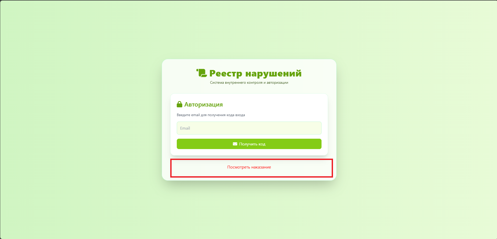
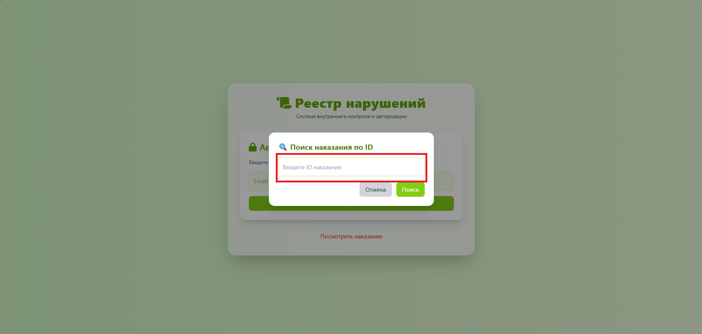
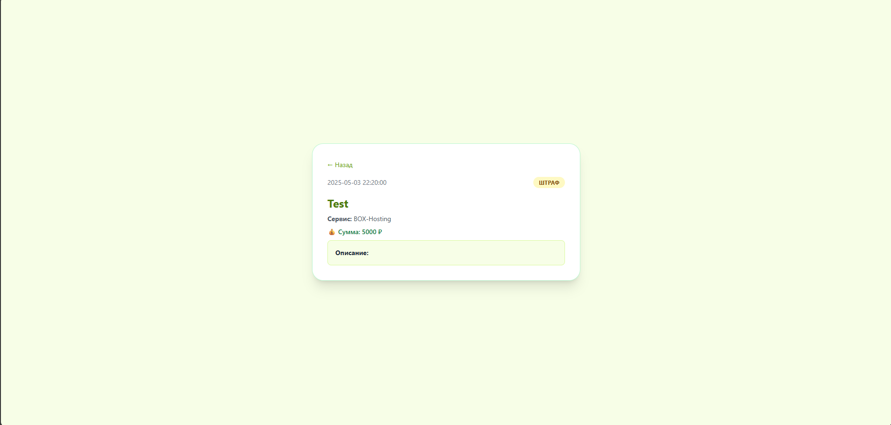

# 🛑 Как узнать подробности нарушения по айди?
### Через реестр:

1. Зайдите на [reestr.myid.su](https://reestr.myid.su)
2. Нажмите на "Посмотреть наказание"

3. Вводите айди наказания в строчку

🎉 Готово! Вы получили информацию об наказнии без авторизации в аккаунте.

